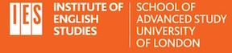

Hacking <em>Moby-Dick</em>

*   [About](cmohge1/hacking-moby-dick/docs/about)
*   [Sessions](cmohge1/hacking-moby-dick/docs/sessions)
*   [Blog](cmohge1/hacking-moby-dick/docs/blog)

Hacking Moby-Dick
=================

This is an experimental seminar series at the Institute of English Studies on how to apply digital approaches to literature. We'll be focusing on _Moby-Dick_. Stay tuned as we compile material over the months of April, May, and June!

*   [Email me!](mailto:christopher.ohge@sas.ac.uk)
*   [Institute of English Studies, School of Advanced Study, University of London](https://www.ies.sas.ac.uk/)
